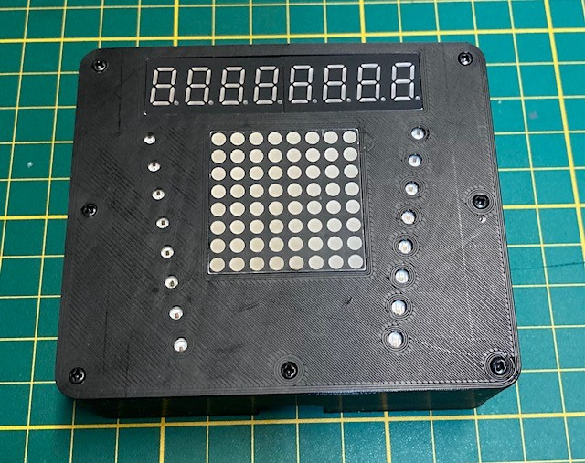
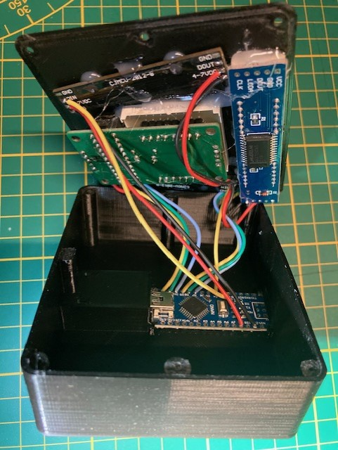
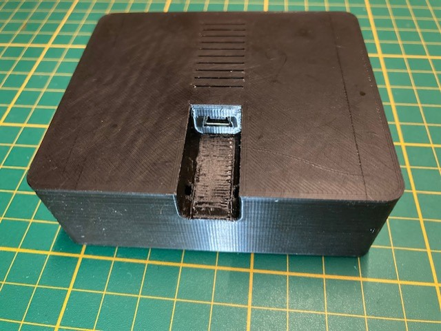
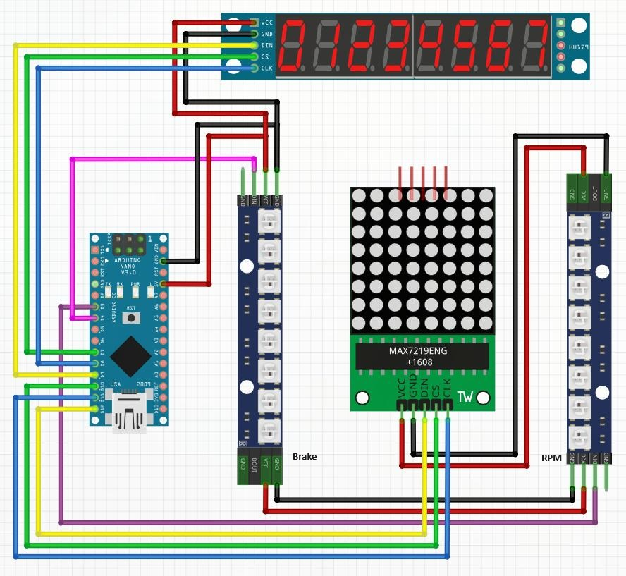
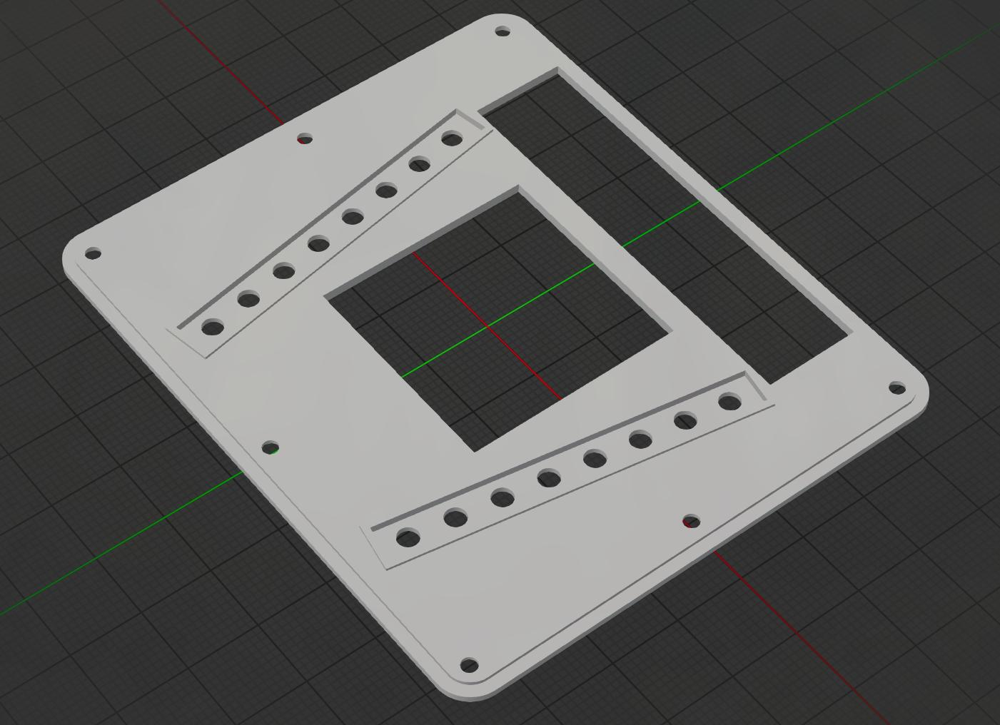
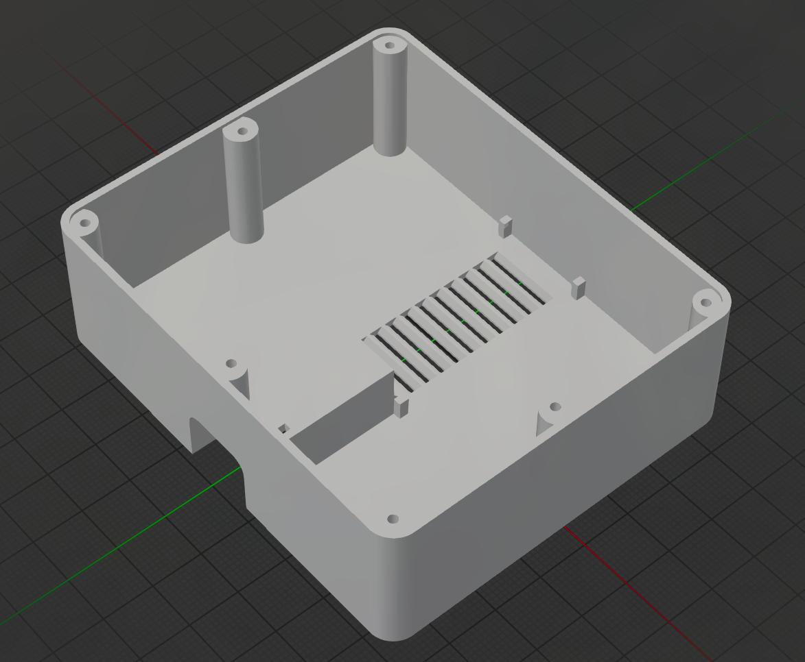

# iRacing Matrix

## Description

Arduino based low latency RPM and gear indicator for the iRacing motorsport simulator.  

## Overview

The goal is to build a plug-and-race, easy to setup, low latency gear and RPM indicator for iRacing.  

It will display your current speed and RPM on the 7 segment display  
On the left led strip you will see the braking percentage,  
and the right strip displays the RPM percentage between 70% and 100%  
The RPM led strip will blink quickly when the RPM percentage is above 99%  
  
</img>  
</img>  
</img>  
  
>STL files included and available on [Thingiverse](https://www.thingiverse.com/thing:6325240)
  
  
*Running the executable*  

*Calibrate the RPM indicator and drive*  
</img>  

*Fast cycle through gears*  
</img>  

## Components

To build iRacing Matrix, you will need the following components:  
>You can buy all the components on [AliExpress](https://s.click.aliexpress.com/e/_DcGzUr5).  
  

1. **Microcontroller Board:**
   - Description: The brain is an Arduino board with mini usb, the Arduino Nano will fit the housing.
   - Example: [Arduino Nano Atmega328 mini usb](https://s.click.aliexpress.com/e/_DkWYniB)

1. **Housing:**
   - Description: The provided housing is build to fit an Arduino nano, feel free to build your own housing.
   - Example: Available in the housing directory or at [Thingiverse](https://www.thingiverse.com/thing:6325240)

2. **Gear indicator:**
   - Description: Gear indicator is a MAX7219 Dot Led Matrix Module
   - Example: [MAX7219 Dot Led Matrix Module](https://s.click.aliexpress.com/e/_Dli12on)

3. **RPM and brake indicator:**
   - Description: RPM and brake indicator are two 8 channel WS2812 505 RGB LED strips
   - Example: [WS2812 5050 8 channel RGB LED](https://s.click.aliexpress.com/e/_DlZAn4x)

4. **Display:**
   - Description: MAX7219 based 8 digits 7 segments display
   - Example: [MAX7219 8 digits 7 segments](https://s.click.aliexpress.com/e/_Dewr8uB)

6. **Screws, Wires and hot glue:**
   - Description: Used for assembling and connecting components.
   - Example:
     - [Silicone 28AWG wires](https://s.click.aliexpress.com/e/_Dm14y7V)
     - [M1.7x6 screws](https://s.click.aliexpress.com/e/_DB2Fljt)
     - [Hot glue gun](https://s.click.aliexpress.com/e/_DlX8qxz)

## Schematic

## Housing

</img>
 </img>  
Download on [Thingiverse](https://www.thingiverse.com/thing:6325240/files)  

## Executable

Download the prebuild [iracing_matrix.exe](https://github.com/jelleh/iracing-matrix/releases/download/v1.0/iracing_matrix.exe), or build it from source with Visual Studio.  
The executable will interact with the iracing API, and send updates over the COM port to the Arduino.  
When started, it will scan all the available COM ports for the iRacing Matrix,  
You can provide a fixed COM in the paramaters for faster startup.  
> iracing_matrix.exe [COM port]  
> e.g.: *iracing_matrix.exe 5*  

## Calibration
The RPM indicator needs to be calibrated once per session.  
When calibration is needed, iRacing Matrix will display *fll thr* on the 7-segment digits.  
Completely stop the car, enter neutral gear, and full throtle.  

## Getting Started

Follow these steps to build and use iRacing Matrix:

1. **Assemble iRacing Matrix:**
   - Connect the microcontroller to your computer and upload the provided Arduino code [iracing_matrix.ino](sketch/iracing_matrix/iracing_matrix.ino).
   - Remove the sides (mounting holes) from the 7-segment display with a hacksaw, otherwise it will not fit. (see pictures)
   - Follow the circuit diagram to connect the components to the microcontroller.
   - Download the [stl files](./housing), and print the housing.
   - Glue the components to the front part of the housing with some hot glue.
   - Secure the Arduino nano in the housing, first put the mini usb in the opening, and push the Arduino all the way down.
   - Attach the front and base toghther with seven M1.7x6 screws.

2. **Connect:**
   - Connect the Arduino via usb to you computer.

3. **Run:**
   - Run [iracing_matrix.exe](https://github.com/jelleh/iracing-matrix/releases/download/v1.0/iracing_matrix.exe) on your iRacing pc. It will automiticly scan the COM ports for iRacing Matrix.

4. **Calibrate:**
   - Enter an iRacing session, and full throtle in netrual gear to calibrate the RPM indicator.

5. **Race:**
   - Exit the pit, and race.

## License

This project is licensed under the [BSD-3-Clause](LICENSE).

---
